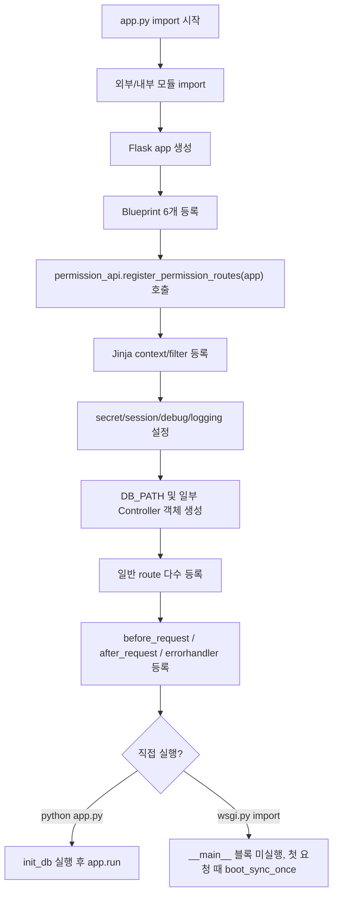

# 1단계 런타임 진입 분석 보고서

작성일: 2026-06-13

## 1단계의 의미

1단계는 Flask 앱이 import되거나 실행될 때 어떤 순서로 초기화되는지 확인하는 단계다.

이번 단계에서는 다음을 확인했다.

- import 구조
- Flask app 생성 위치
- Blueprint 및 permission route 등록
- 전역 설정과 전역 객체 생성
- 요청 전후 훅
- 직접 실행과 WSGI 실행 차이
- 앱 시작 또는 첫 요청 시 부작용 후보

이번 단계에서도 앱 코드는 수정하지 않았고, 서버 실행/DB 접속/브라우저 테스트도 하지 않았다.

## 확인한 명령

```powershell
rg -n "import|Flask|register_blueprint|before_request|after_request|route|if __name__|app.run" app.py wsgi.py
rg -n "Blueprint\(|@.*\.route|def register_permission_routes|register_blueprint" add_page_routes.py boards/safety_instruction.py permission_api.py
rg -n "Blueprint\(" -g "*.py"
rg -n "dept_permission|dept_permission_bp|register_blueprint\(.*dept" -g "*.py"
python -c "AST 기반 import/decorator/route 정적 추출"
```

## 전체 시작 순서

정적 분석 기준 `app.py`의 시작 흐름은 다음과 같다.



## import 구조

`app.py`는 상단 import만 55개 수준이다.

주요 그룹은 다음과 같다.

- Flask 기본 객체: `Flask`, `render_template`, `request`, `jsonify`, `session`, `redirect`, `send_file`
- 설정/DB: `database_config.db_config`, `partner_manager`, `get_db_connection`, `execute_SQL`
- 게시판 공통 서비스: `CodeService`, `ItemService`, `ColumnConfigService`, `SearchPopupService`, `ColumnSyncService`
- 권한/감사: `permission_helpers`, `audit_logger`, `permission_api`, `permission_utils`
- 파일/업로드: `upload_utils`, `sanitize_filename`, `validate_uploaded_files`
- SSO/인증서: `jwt`, `uuid`, `ssl`, `cryptography.x509`
- 스케줄러: `threading`, `schedule`, `time`
- 일부 중복 import: `threading`, `json`

주의할 점은 `app.py` import 자체가 단순 로딩이 아니라 많은 전역 등록과 객체 생성을 동반한다는 것이다.

## Flask 앱 생성

Flask 앱은 다음 위치에서 생성된다.

- `app.py:110`

```python
app = Flask(__name__, static_folder='static')
```

이 직후 Blueprint와 permission API가 즉시 등록된다.

## Blueprint 등록

`app.py`에서 직접 등록되는 Blueprint는 6개다.

- `follow_sop_bp`
- `full_process_bp`
- `safety_instruction_bp`
- `safe_workplace_bp`
- `subcontract_approval_bp`
- `subcontract_report_bp`

등록 위치는 다음과 같다.

- `app.py:111`
- `app.py:112`
- `app.py:113`
- `app.py:114`
- `app.py:115`
- `app.py:116`

추가로 `permission_api.register_permission_routes(app)`가 호출되어 permission 관련 라우트를 직접 `app`에 붙인다.

- `app.py:117`
- `permission_api.py:176`

## Blueprint 후보 중 미등록 의심 항목

전체 Python 파일에서 `Blueprint(`를 검색한 결과 다음 7개가 발견됐다.

- `add_page_routes.py`의 5개 Blueprint
- `boards/safety_instruction.py`의 `safety_instruction_bp`
- `dept_permission_api.py`의 `dept_permission_bp`

이 중 `dept_permission_api.py`의 `dept_permission_bp`는 `app.py`에서 import/register되는 흔적이 없다.

- `dept_permission_api.py:12`
- `dept_permission_api.py:412`

`dept_permission_api.py`는 파일 단독 실행 시에만 자체 Flask app을 만들고 `dept_permission_bp`를 등록한다.

따라서 현재 메인 앱 기준으로는 미등록 Blueprint 후보로 보인다.

단, `permission_api.py` 안에도 `/api/dept-permissions/...` 라우트가 존재하므로, 단순 누락인지 과거 파일이 남은 것인지는 2단계 라우트 지도에서 더 확인해야 한다.

## 전역 설정 및 전역 객체

주요 전역 설정은 다음 순서로 적용된다.

- `app.secret_key = db_config.config.get('DEFAULT', 'SECRET_KEY')`
- 세션 쿠키 설정
- `app.debug = db_config.config.getboolean('DEFAULT', 'DEBUG')`
- Jinja filter 등록
- `DB_PATH = db_config.local_db_path`
- `SafetyInstructionController` 전역 생성
- `AccidentController` 전역 생성
- `PASSWORD`, `ADMIN_PASSWORD` 전역 설정
- logging 설정
- template auto reload 및 static cache 비활성화

전역 Controller 생성 위치는 다음과 같다.

- `app.py:371`
- `app.py:377`

이 구조는 `app.py` import 시점에 컨트롤러와 repository 객체가 만들어진다는 뜻이다. 실제 DB 접속이 생성자 안에서 발생하는지 여부는 컨트롤러/리포지토리 분석 단계에서 별도 확인이 필요하다.

## 요청 전 훅

확인된 `before_request` 훅은 3개다.

### `check_first_request`

- 위치: `app.py:864`
- 역할: 첫 요청에 `boot_sync_once()` 실행
- 핵심 부작용: `boot_sync_once()` 안에서 `init_db()`를 호출한다.

즉 WSGI로 실행하면 `__main__` 블록은 실행되지 않지만, 첫 요청 때 DB migration/seed 성격의 `init_db()`가 실행될 수 있다.

### `ensure_periodic_master_sync`

- 위치: `app.py:871`
- 역할: `_master_sync_enabled`가 켜져 있으면 10분 간격으로 마스터 sync 필요 여부 확인
- 핵심 부작용: 조건 충족 시 `maybe_daily_sync_master(force=False)` 호출

현재 `config.ini` 기준으로는 외부 DB와 초기 sync 플래그가 꺼져 있어 기본 활성화 가능성은 낮아 보인다. 다만 운영 설정에서는 다를 수 있다.

### `auto_sso_redirect`

- 위치: `app.py:10157`
- 역할: 세션이 없는 일반 페이지 요청을 `/SSO` 또는 `/sso/dev-login`으로 redirect
- 제외 경로: `/SSO`, `/sso`, `/acs`, `/slo`, `/static`, `/uploads`, `/api`, `/admin/...` 등

이 훅은 라우트 동작 전체에 영향을 주므로, 화면 테스트 시 SSO 설정과 dev-login 설정을 같이 봐야 한다.

## 요청 후 훅

확인된 `after_request` 훅은 2개다.

### `add_header`

- 위치: `app.py:8534`
- 역할: 모든 응답에 no-cache 헤더 추가

### `audit_request_activity`

- 위치: `app.py:8549`
- 역할: 요청/응답 단위 감사 로그 기록
- 제외 경로: `/api/admin/audit-logs`, `/api/admin/usage-dashboard`, static, favicon, OPTIONS

주의점은 `wsgi.py`에서는 static cache를 1년으로 설정하지만, `app.py`의 `after_request`는 응답에 no-cache를 넣는다. 정적 파일에 대해서는 `audit_request_activity`는 제외하지만 `add_header`는 전체 응답에 적용될 수 있어 캐시 정책 충돌 여부를 확인해야 한다.

## 에러 핸들러

확인된 에러 핸들러는 2개다.

- `403`: `errors/403.html` 렌더링
- `401`: API 요청이면 JSON, 일반 요청이면 `login` endpoint로 redirect

주의점은 `login` endpoint가 실제로 존재하는지 2단계 라우트 지도에서 확인해야 한다.

## 직접 실행 흐름

`python app.py` 직접 실행 시 흐름은 다음과 같다.

1. `init_db()` 실행
2. 외부 DB가 켜져 있으면 `maybe_daily_sync()` 실행
3. `COLUMNS.SYNC_ON_STARTUP=true`면 JSON 컬럼 설정 동기화
4. Werkzeug reloader 메인 프로세스 조건에서 schedule thread 시작
5. SSL 인증서 경로 확인
6. 인증서 로드 성공 시 HTTPS `44369`
7. 인증서 로드 실패 시 HTTP `5000`

직접 실행부 위치는 다음과 같다.

- `app.py:10464`
- `app.py:10537`
- `app.py:10541`

## WSGI 실행 흐름

`wsgi.py`는 다음을 수행한다.

1. `APP_ENV=prod`
2. `FLASK_ENV=production`
3. `from app import app`
4. static cache 기본값 1년 설정
5. `app.debug=False`
6. `app.testing=False`

중요한 차이는 `wsgi.py`가 `app.py`를 import만 하므로 `if __name__ == "__main__"` 블록은 실행하지 않는다는 점이다.

대신 첫 요청 때 `check_first_request -> boot_sync_once -> init_db()` 흐름이 작동할 수 있다.

## 정적 라우트 중복 확인

AST 기준으로 다음 파일의 라우트 데코레이터를 확인했다.

- `app.py`
- `add_page_routes.py`
- `boards/safety_instruction.py`
- `permission_api.py`

확인된 route decorator는 총 263개다.

동일 path가 GET/POST 등 다른 method로 나뉜 경우는 많다. 이는 일반적인 REST 패턴이다.

동일 path + 동일 method의 명백한 중복은 정적 분석 기준 0개였다.

단, Flask의 동적 라우트 우선순위, catch-all, Blueprint endpoint 충돌은 앱을 실제 import하여 `app.url_map`을 확인하는 2단계에서 다시 검증해야 한다.

## 1단계 핵심 위험

1. `app.py` import가 무겁다.
   - import 시점에 Flask app, Blueprint, permission routes, Jinja filters, controllers가 모두 만들어진다.

2. 첫 요청이 DB 초기화를 유발한다.
   - WSGI 실행에서도 첫 요청 때 `init_db()`가 실행될 수 있다.

3. 직접 실행과 WSGI 실행의 초기화 경로가 다르다.
   - 직접 실행은 시작 시 `init_db()`.
   - WSGI는 첫 요청 시 `init_db()`.

4. cache 정책이 충돌할 수 있다.
   - `app.py`는 no-cache.
   - `wsgi.py`는 static cache 1년.

5. `dept_permission_api.py`는 미등록 Blueprint 후보로 보인다.
   - 단독 실행용 잔재인지, 실제 누락인지 확인 필요.

6. `401` 에러 핸들러가 `login` endpoint를 참조한다.
   - 실제 endpoint 존재 여부 확인 필요.

7. 중복 import와 거대한 `app.py`가 유지보수 위험이다.
   - `json`, `threading` 중복 import가 있고, 라우트/초기화/SSO/권한/게시판 로직이 한 파일에 몰려 있다.

## 1단계 결론

이 프로젝트의 현재 구조는 "완전히 무질서"라기보다는, 기존 대형 `app.py` 위에 일부 게시판만 Controller/Repository/Blueprint로 점진 분리된 과도기 구조에 가깝다.

즉 지금 바로 대규모 리팩터링을 하면 위험하다.

먼저 해야 할 일은 다음이다.

1. 실제 런타임 라우트 지도 작성
2. 미등록/레거시 라우트 구분
3. 첫 요청 DB 초기화의 안전성 확인
4. 게시판별로 기존 방식과 신형 Controller 방식이 섞인 지점 표시

다음 단계는 2단계 라우트 전체 지도 작성이다.
